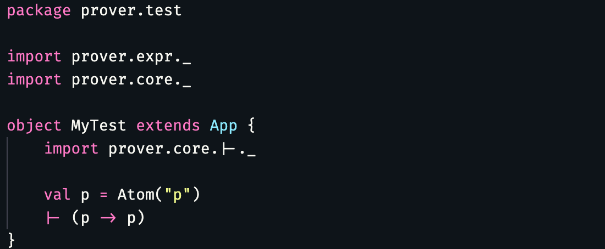

# WangProver

An Automatic Theorem Prover for L(X) in Wang's Book (数理逻辑 第2版 汪芳庭) in Scala.

## Build the Project

### Install SBT

SBT is required to build this project. You can install it from [Installing sbt](https://www.scala-sbt.org/1.x/docs/Setup.html)

### Compile and Run

```sh
$ sbt "run"
```

## Usage

To prove a simple theorm, just code:

```scala
package prover.test

import prover.expr._
import prover.core._

object MyTest extends App {
    import prover.core.|-._

    val p = Atom("p")
    |- (p -> p)
}
```

This will start to prove the Theorm "p -> p".

To get full proof of the theorm, add `|-.print_proof = true` to enable printing.

You will get:

```
[info] prove for p -> p with assumption List()
[info] proved for total 5 cases
[info] the length of the proof of p -> p : 5
    1: p -> (<8> -> p)                                   [L1]
    2: p -> ((<8> -> p) -> p)                            [L1]
    3: (p -> ((<8> -> p) -> p)) -> ((p -> (<8> -> p)) -> 
    3: (p -> p))                                         [L2]
    4: (p -> (<8> -> p)) -> (p -> p)                     [MP]
    5: p -> p                                            [MP]
```

> Note: `<8>` means you can use any expression to replace it. (`<8>` is generated by the algorithm)

To change the number of character each line, just use `|-.print_length = 100` ( the default is 50)

We highly recommand a font [Fira Code](https://github.com/tonsky/FiraCode) when dealing with all kinds of symbols. It looks like:



Other example and tests are in `maintest.scala`

> Note: the project had NOT completed yet. The Prover has many limitations.


